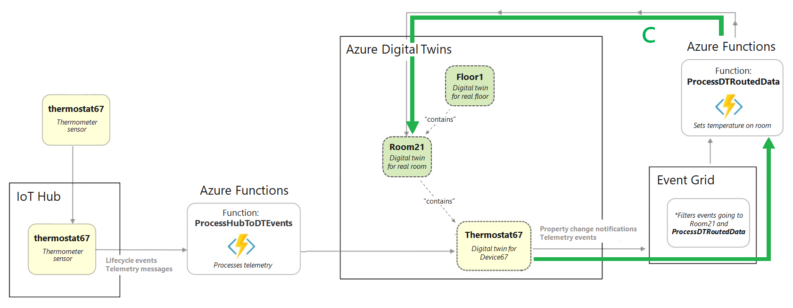

# Generalised Twin property change propagation sample

This sample shows how to develop a generalised approach for propagating Twin events through the graph by using relationship properties.

Technical Architecture for [change propagation](https://docs.microsoft.com/en-us/azure/digital-twins/tutorial-end-to-end#propagate-azure-digital-twins-events-through-the-graph):



```json
{
    "@id": "dtmi:sample:genpropchanges:Asset;1",
    "@type": "Interface",
    "contents": [
        {
            "@type": "Property",
            "name": "Temperature",
            "schema": "float",
            "writable": true
        }, 
        {
            "@type": "Relationship",
            "name": "contains",
            "target": "dtmi:sample:genpropchanges:Asset;1",
            "writable": true
        },
        {
            "@type": "Relationship",
            "name": "definedby",
            "target": "dtmi:sample:genpropchanges:Device;1",
            "properties": [
                {
                    "@type": "Property",
                    "name": "propPath",
                    "schema": "string"
                },
                {
                    "@type": "Property",
                    "name": "devicePropPath",
                    "schema": "string"
                }
            ],
            "writable": true
        }
    ],
    "@context": "dtmi:dtdl:context;2"
}
```